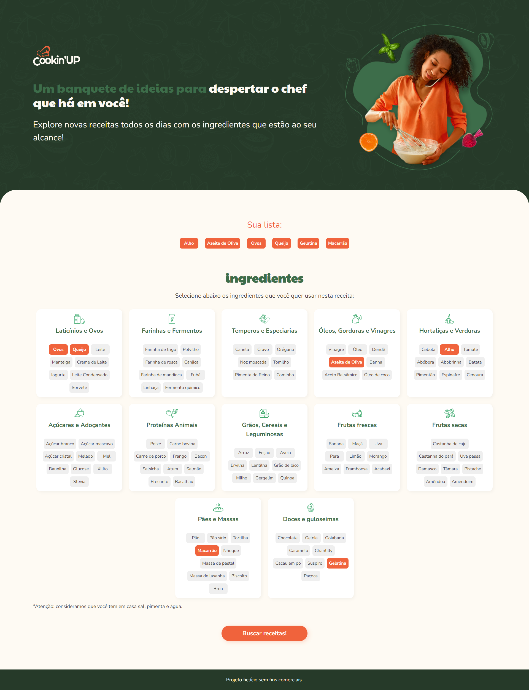
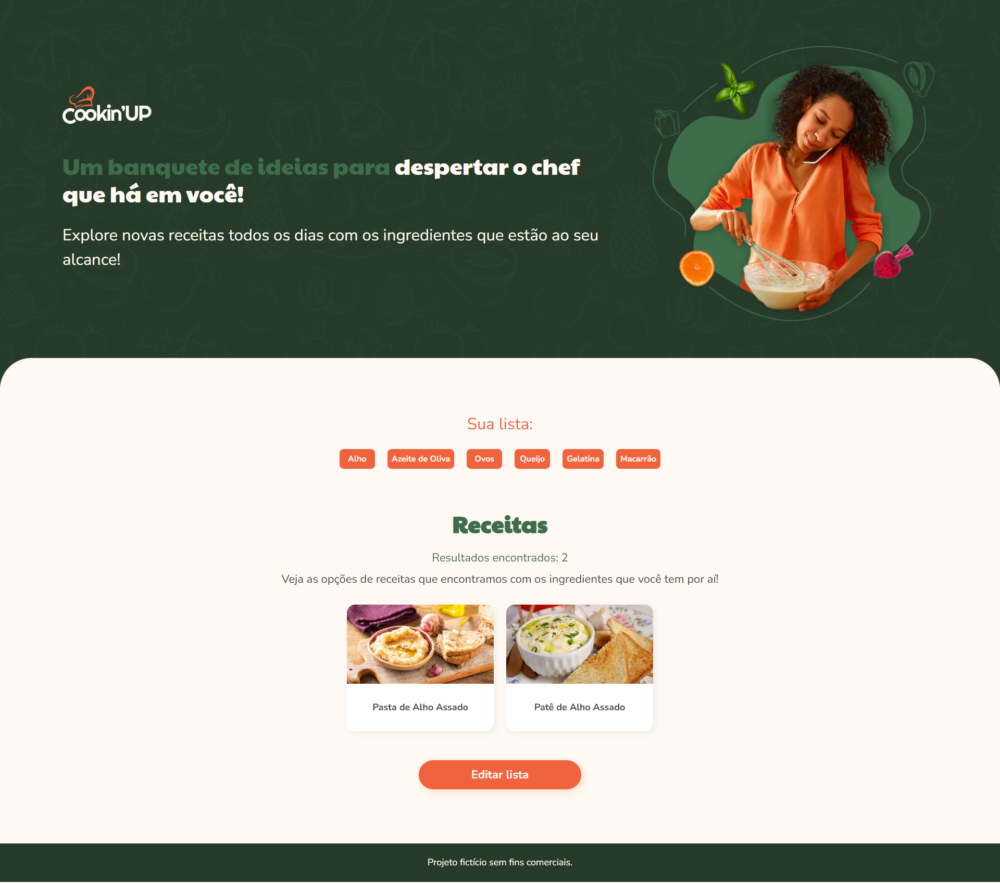

# cookin-up

Projeto criado durante o curso [Vue 3: entendendo componentes, diretivas e reatividade no framework](https://www.alura.com.br/curso-online-vue-3-componentes-diretivas-reatividade-framework), da Alura.

